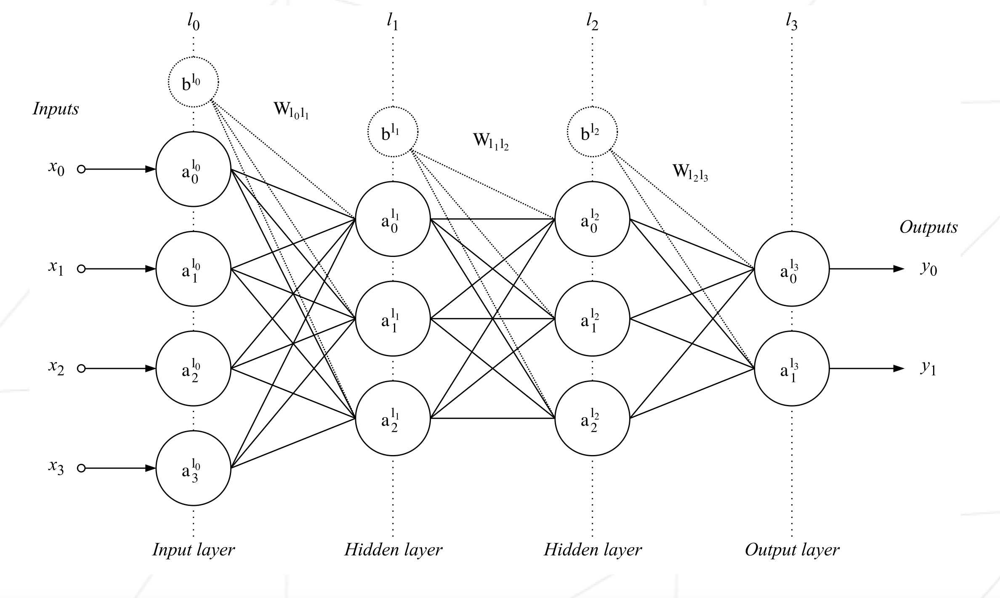
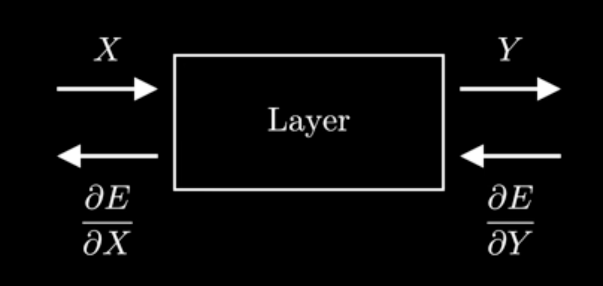
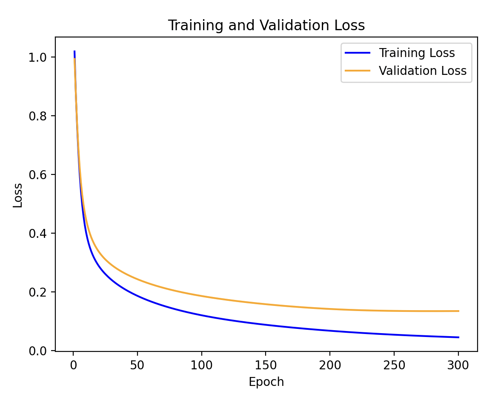
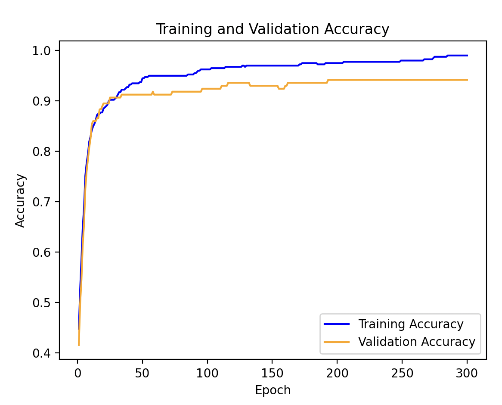

## Overview

This project designs and trains a neural network from scratch for binary classification of breast cancer tumors (benign vs malignant) based on the cell nucleus characteristics from the Wisconsin Breast Cancer dataset.

## Concepts

### What is a Multilayer Perceptron

<p align="center">  </p>

A multilayer perceptron (MLP) is a feedforward neural network consisting of multiple layers of neurons. Data flows from the input layer through one or more hidden layers to the output layer. The network learns by adjusting weights and biases through backpropagation and gradient descent, minimizing the difference between predicted and actual outputs.

### Different Types of Layers

- **Dense Layer**: A fully connected layer containing a set number of neurons. Each neuron receives input from all neurons in the previous layer. The layer stores:
  - `weights`: 2D array of shape [output_size, input_size] 
  - `bias`: 1D array of shape [output_size, 1]

- **Activation Layer**: Applies a non-linear activation function to the output of a dense layer. These functions include:
  - **Sigmoid**: 1/(1 + e<sup>-x</sup>) - outputs values between 0 and 1
  - **ReLU**: max(0, x) -  outputs the input if positive, otherwise outputs 0.
  - **Softmax**: Used in the output layer to convert raw scores into probability distributions

### Forward Propagation

<p align="center">  </p>

Forward propagation passes input data through the network layer by layer to generate predictions:

1. **Dense Layer Forward Pass**: Calculate the weighted sum of inputs plus bias

``````````````
output_vector = weights_matrix · input_vector + bias_vector
``````````````

2. **Activation Layer Forward Pass**: Apply the activation function

``````````````
output = activation_function(input)
``````````````

3. Repeat for each layer until reaching the output, which gives the predicted probabilities for each class.

### Calculate Cost

The cost function measures how far the network's predictions deviate from the actual labels. For this project, we use **binary cross-entropy loss**:

<p align="center">
E = -1/N Σ[y<sub>n</sub> log(p<sub>n</sub>) + (1 - y<sub>n</sub>)log(1 - p<sub>n</sub>)]
</p>

where:
- **N**: number of samples
- **y<sub>n</sub>**: actual label (one-hot encoded: [1,0] for benign, [0,1] for malignant)
- **p<sub>n</sub>**: predicted probability from softmax output

The goal of training is to minimize this cost function.

### Backward Propagation and Gradient Descent

Backward propagation computes gradients of the cost function with respect to weights and biases using the **chain rule**:

**Dense Layer Gradients**:

<p align="center">
∂E/∂W = ∂E/∂z · x<sup>T</sup>

∂E/∂b = ∂E/∂z

∂E/∂x = W<sup>T</sup> · ∂E/∂z
</p>

Where: 

- ∂E/∂W: gradient with respect to weights (used to update weights)
- ∂E/∂b: gradient with respect to bias (used to update bias)
- ∂E/∂x: gradient with respect to input (passed to previous layer)
- ∂E/∂z: gradient from the next layer (output_gradient)

**Activation Layer Gradient**:

<p align="center">
∂E/∂z = ∂E/∂a ⊙ σ'(z)
</p>

where **⊙** denotes element-wise multiplication and **σ'** is the derivative of the activation function.

**Weight Update (Gradient Descent)**:

For batch processing, gradients are accumulated across the batch:

<p align="center">
W<sub>new</sub> = W<sub>old</sub> - learning_rate × (Σ∂E/∂W) / batch_size
</p>
<p align="center">
b<sub>new</sub> = b<sub>old</sub> - learning_rate × (Σ∂E/∂b) / batch_size
</p>

The gradient tells us which direction reduces the cost, so we subtract it to move towards the minimum cost, and the learning_rate controls the step size. 


## Process

### 1. Split the Dataset

Separate the data into training and validation sets based on `TRAIN_PERCENTAGE` in Makefile. This randomizes the data and splits it according to the specified percentage. If `SEED` is set to a positive value, the split is reproducible.

### 2. Train the Model

Training process:

1. **Build network and initialize weights**
	- Construct layers based on `LAYERS` configuration
	- Initialize weights using `WEIGHTS_INITIALISER` method
	- Add activation layers after each dense layer
	- Final layer uses softmax activation for probability output

2. **Forward propagation**
	- Pass training data through network
	- Each dense layer computes: z = Wx + b
	- Each activation layer applies: a = σ(z)
	- Output layer produces probability distribution via softmax

3. **Calculate cost**
	- Compute binary cross-entropy loss
	- Track both training and validation losses and accuracy

4. **Backward propagation**
	- Calculate output gradient: y<sub>pred</sub> - y<sub>true</sub>
	- Propagate gradient backward through layers
	- Update weights after processing batch using gradient descend

5. **Output parameters and plots**
   - Display loss and validation loss per epoch
   - Save trained model with weights, biases, normalization parameters

### 3. Make Predictions

Prediction process:
1. Load saved model (weights, biases, normalization parameters)
2. Normalize test data
3. Perform forward propagation
4. Convert softmax output to class prediction
5. Evaluate accuracy on test dataset

## Configuration Settings in Makefile

**Configuration Details**:
- **TRAIN_PERCENTAGE**: Proportion of data used for training (0.7 = 70% train, 30% validation)
- **SEED**: Random seed for reproducibility (-1 for random split)
- **EPOCHS**: Number of complete passes through training data
- **LAYERS**: List of neurons per hidden layer
- **LEARNING_RATE**: Step size for gradient descent (smaller = slower but more stable)
- **BATCH_SIZE**: Number of samples before updating weights (1 = SGD, higher = mini-batch)
- **ACTIVATION_FT**: Activation function for hidden layers
- **WEIGHTS_INITIALISER**: Method for initializing weights

## Results

Below shows examples of results obtained during training

**Loss graph**



**Accuracy graph**

